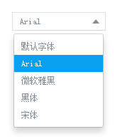

## vue-toast
a vue dropdwon menu component

### Install

```bash
npm install vue-dropdownmenu -S

yarn add vue-dropdownmenu
```

### QuickStart
```javascript
require('vue-dropdownmenu/dist/vue-dropdown.css');

// in ES6 modules
import dropdown from 'vue-dropdownmenu';

// in CommonJS
const dropdown = require('vue-dropdownmenu');

// in Global variable
const dropdown = VueDropdown.dropdown;

Vue.component('c-dropdown',dropdown);
```
```javascript
<c-dropdown v-model="fontFamily" :text-width="100" :menus="aFontFamily"></c-dropdown>
```

### Params

Parameter | Type |Default| Description
--------- | ---- | ------|-----------
value | `string` |  | two way binding text show in dropdwon's text area
meus | `string` |  | the menu's array, a object array,width value and text property
textWidth | `number` |  | text area width
type | `string`| `radio` | select mode, radio or checkbox
selectedClose | `boolean` | `true` | whether to close menu when menu item selected


### Preview

